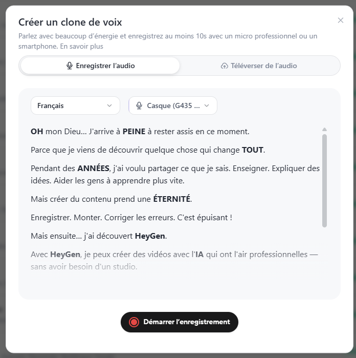

- Retravailler chaque modèle indépendemment pour en exploiter correctement les paramètres et option.

- Ajouter la fonctionnalité pour cloner la voix et pour générer une voix grâce à l'api d'elevenLabs.

- Ajouter la fonctionnalité pour générer une voix grâce au speech to generate voice d'eleven labs.

CREATE VOICE

```
┌─────────────────┐ ┌─────────────────┐ ┌─────────────────┐
│ ✨ Design Voice │ │ 🎤 Clone Voice  │ │ 📚 Voice Library│
│                 │ │                 │ │                 │
│ Describe the    │ │ Upload an audio │ │ Choose an       │
│ voice you want  │ │ sample          │ │ existing voice  │
└─────────────────┘ └─────────────────┘ └─────────────────┘
```

-  Si on décide de cloner avec sa propre voix, alors il faudrait lire un text. Le screen shot provient de Heygen.

- Ajouter la possibilité de pouvoir se cloner sois-même grâce à l'api de Heygen en utilisant le modèle Avatar. 

- Ajouter une fonctionnalité pour améliorer le prompt de l'utilisateur dans chaque mode "Acteurs parlants, Image, Vidéo ou dans les options avancés". ça doit utiliser un modèle LLM gratuit et permettre de pouvoir améliorer contextuellement le prompt de l'utilisateur afin d'essayer d'atteindre un meilleur résutlat.

- Améliorer l'UI de réglage de l'acteur pour la voix car actuellement c'est vraiment dégueulasse. 

- S'assurer que si on lance les générations en plusieurs exemplaires, ces générations soient bien lancer en même temps/parallèles. Pour ne pas que le temps d'attente soit additionnel. 

- `kling.png` est dans `assets/brand/providers/` mais n'est utilisé nulle part : l'id du credential est `fal`, donc c'est `fal.png` que la carte lit. La carte s'appelle pourtant « Kling (via fal.ai) » — si la marque Kling parle plus, renommer `kling.png` par-dessus `fal.png`.
